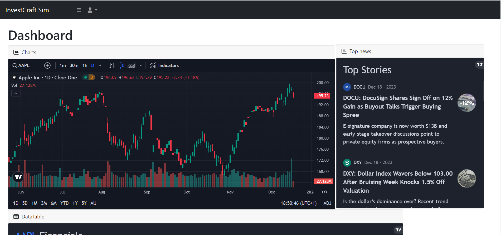
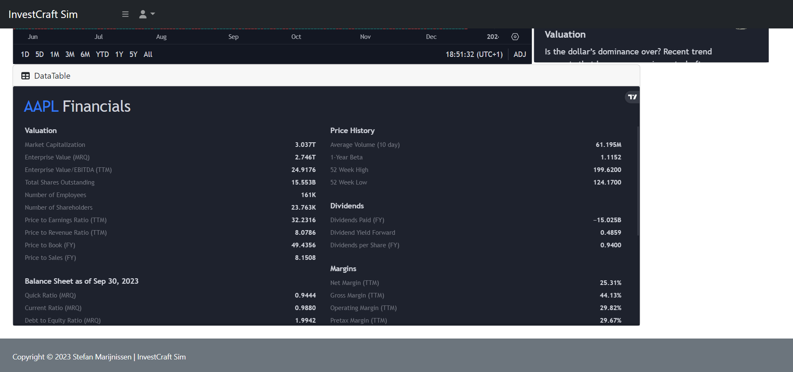
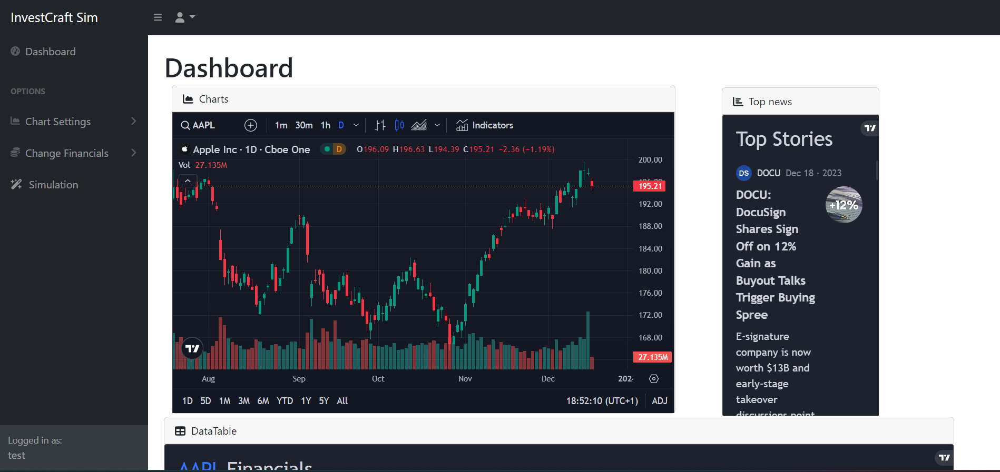
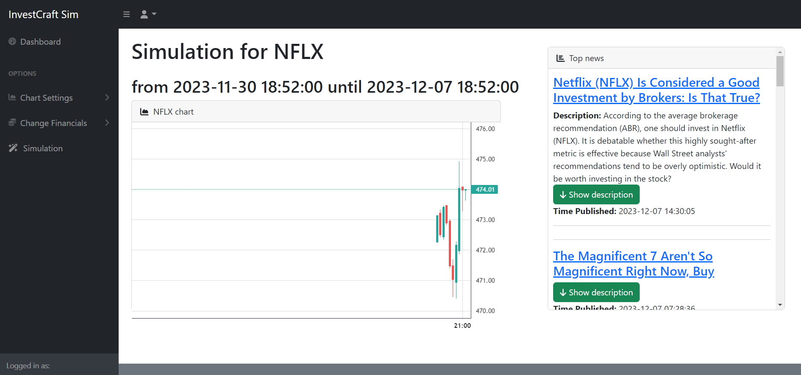
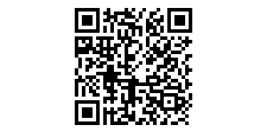

# Investcraft Sim
***
# Some illustration pictures.

***
# Beschrijving

De webapplicatie zal vooral bedoeld zijn voor mensen die ge-ïnteresseerd zijn in het analyseren van de aandelenmarkt en vooral, waarom bepaalde prijsbewegingen zich voor doen op bepaalde punten. De applicatie heeft een eenvoudig dashboard die eenvoudig aanpasbaar is naar wens waarbij het nieuws, De grafieken en de financiele informatie gecombineerd op 1 dashboard op dezelfde webpagina beschikbaar zijn. Verder is het mogelijk om je eigen simulatie te runnen waarbij je een gedeelte van de markt in het verleden opnieuw afspeeld. Daarbij verschijnen dan ook nieuwsberichten en kan de gebruiker snel en eenvoudig herleiden waarom bepaalde prijsbewegingen zich hebben voor gedaan met de nieuwberichten die zijn bijgevoegd uit die periode.

***
# Instructies
pull de github en daarna in ubuntu:
  <mark>pip3 install -r requirements.txt</mark> 
<mark>flask run --debug</mark> zal de applicatie runnen.
***

# references
- https://github.com/karthik947/TVChartsOwnData Voor het weergeven van een statische grafiek. Code waar ik de chart echt weergeef heb ik gedeeltelijk overgenomen in chart.js

- https://www.youtube.com/watch?v=d-M-8WHdb5E Codewithj, hoe ik de Alpaca Trading API in in config.py aanmaak en hoe ik de stock string kon formatteren zodat de tradingwidget begreep welke stock erin moest. Heeft bijgedragen aan configAPI.py, niet dezelfde code maar liet zien hoe ik in models.py convertwatchlist goed moest formatteren en een regel in dashboard.html 1 lijn gebruikt.

- https://www.youtube.com/watch?v=EjQ-3iXEPEs Part Time Larry, Heeft me geholpen te begrijpen hoe ik van de alpaca api, data kon verkrijgen en hoe ik de documentatie moest interpreteren. Helaas was de code die hij gebruikte outdated doordat de API nu een v2 versie had inplaats van v1, maar veel terminologie was hetzelfde. qua code bijgedragen aan configAPI.py.

- https://github.com/startbootstrap/startbootstrap-sb-admin Bootstrap template.

- https://www.tradingview.com/widget/ Hiervandaan haal ik de basis widgets in het dashboard, de code in de html van index.html waar tradingview.widget staat is hiervandaan afkomstig.

Afgezien daarvan is er geen code gekopieerd vanaf andere platformen. Ik heb wel enkele platforms zoals w3schools, Stack Overflow of Reddit gebruikt om bepaalde concepten beter te begrijpen en ik heb enkele educatieve websites bezocht die verschillende voorbeelden uitlegden van wat ik probeerde te bereiken. Er is geen code gekopieerd van deze instanties en ze dienden alleen ter begrip van de concepten.

***
# Video Links
here is the Youtube link: 
https://youtu.be/6uQHKZMBzYc
 
 
 
For better quality video scan the QR-code.  

***
