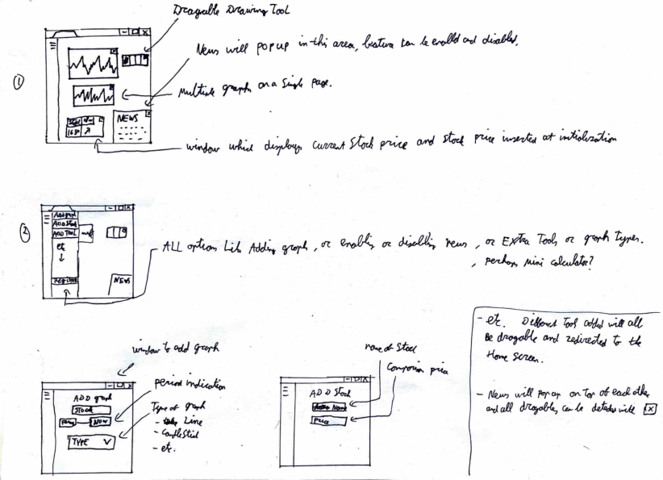

# Projectvoorstel Stefan Marijnissen (13232282)
## Vraag 1
Traders ervaren vaak beperkingen bij het nemen van geïnformeerde handelsbeslissingen vanwege het ontbreken van een platform dat real-time koersinformatie, technische analyse tools portfolio-tracking en nieuwsinformatie combineert. Bestaande handelsplatforms bieden mogelijk niet alle gewenste functionaliteiten in dezelfde app waardoor traders mogelijk meerdere webapps tegelijk moeten raadplegen om een volledig beeld van hun beleggingen te krijgen. Dit kan leiden tot 
- inefficiënte handelsbeslissingen
- een minder aangename gebruikerservaring. 
- een gebrek aan overzicht. 

Het doel van dit project is om een alles-in-één trading web app te creëren die alle bovenstaande componenten heeft.

AANGEPAST IDEE VAN JELLE:
Maak een trading simulator maar dan met de data van een andere datum of langere periode in het verleden. Veel handiger omdat je dan daadwerkelijk kan reflecteren op nieuws en omdat het toch een leer-omgeving is hiermee te werken. Verder heb je het probleem niet meer van het live binnenkrijgen van informatie, maar je kan informatie opvragen met betrekking tot de dag ervoor. Dit kan je doen door data te verzamelen van een maand ervoor en deze data interactief op te slaan, Dit kan je vervolgens gebruiken om bepaalde bijvoorbeeld dagen aan t eind van de maand weg te gooien. Dit is makkelijker en geeft een beter leerdoel. Verder oefen je dus met data van Eerdere momenten en heb je een interactieve leer omgeving op basis van data uit het verleden.

## Vraag 2

De web app zal vooral bedoeld zijn voor actieve traders, die dagelijks aandelen kopen en verkopen en ook analyses uitvoeren. maar deze web app kan ook gebruikt worden door traders die minder actief zijn en simpelweg aandelen willen vasthouden en de koers simpelweg willen analyseren. Verder kan het ook gebruikt worden voor mensen die simpelweg willen oefenen met het handelen in aandelen.

## Vraag 3
Het project zal bedoeld zijn om gebruikt te worden op desktop. 

## Vraag 4
Het verschil met andere trading analyse apps, is dat je bij deze app, zowel technische analyses als live koersinformatie, als live nieuws berichten krijgt binnen dezelfde web app. Verder is het mogelijk om gekochte aandelen weer te geven en de winst of veries op dat aandeel ten opzichte van toen het gekocht werd. Deze app is wel bedoeld voor pure analyse en echte aandelen kunnen niet gekocht worden.  

## Schets

## Features
- alle opties in het hoofdscherm zijn dragable.
- verschillende soorten grafieken beschikbaar.
- tekentools beschikbaar.
- meerdere analysetools beschikbaar.
- nieuws popups rechtsonder .
- stock overzicht.
- mogelijkheid rekenmachientje.
- meerdere grafieken tegelijk kunnen displayen.
- kunnen inloggen en registreren.
- Nep geld kunnen depositen en hiervan een overzicht hebben

## features die moeten bestaan
- verschillende soorten grafieken.
- tekentools beschikbaar
- kunnen inloggen en registreren
  
## volgorde minder belangerijke features
- meerdere grafieken tegelijk kunnen displayen
- nieuwspopups rechtsonder
- stock overzicht
- meerdere analysetools
- nep geld kunnen depositen.
- alle opties in het hoofdscherm zijn dragable.

## Vereisten (op basis van kennis op moment van schrijven.)

1. **Frontend:**
   - HTML,CSS,javascript
   - Integreer javascript voor grafieken om verschillende soorten grafieken weer te geven.

2. **Backend:**
   - Flask (gebaseerd op Python)
   - Implementeer functionaliteit voor gebruikersregistratie en login.
   - Zorg voor opslag van gebruikersgegevens en portfoliogegevens.

3. **Database:**
   - Integreer een database voor het opslaan van gebruikersgegevens met sql

4. **API's:**
   - Integreer financiële API's voor het verkrijgen van realtime informatie over aandelen en nieuwsartikelen.
   - https://rapidapi.com/letscrape-6bRBa3QguO5/api/real-time-finance-data/
   - wellicht andere meerdere API's
  
  

5.  **Gebruiksvriendelijkheid:**
    - Implementeer een intuïtieve gebruikersinterface, met aandacht voor gebruikerservaring (UX) en toegankelijkheid.

## moeilijkheden
- een nieuwsbron vinden en daadwerkelijk het voorelkaar krijgen van een popupvenster.
- refreshen van de grafieken.
- verschillende interactieve grafieken maken op basis van de gegevens.
- een API vinden.
- eventueel gebruik van javascript vanwege beperkte ervaring.
